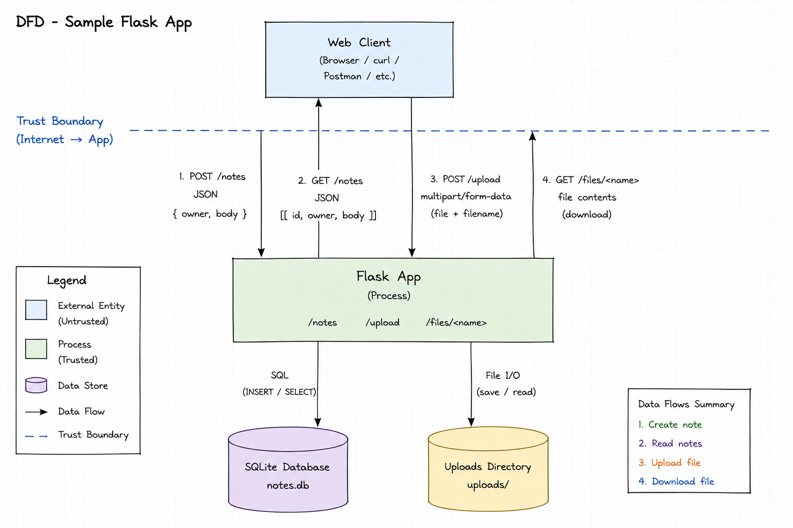

# Threat Model — Sample Flask App

## 1. Data-flow diagram

---

## 2. Elements & trust boundaries

| Element | Type (process/store/entity/flow) | Trust boundary crossed? |
|---|---|---|
| Web client | External entity | Yes (Internet → Flask app) |
| Flask app | Process | Yes (receives untrusted input from the Internet) |
| SQLite DB (`notes.db`) | Data store | No (internal data store accessed by the Flask app) |
| `uploads/` store | Data store | No (internal storage accessed by the Flask app) |

---

## 3. STRIDE analysis

| Element | S | T | R | I | D | E |
|---|---|---|---|---|---|---|
| **/notes** | Client can spoof the `owner` because there is no authentication. | Notes can be created or modified without authorization. | No audit logging of note creation or updates. | All notes can be retrieved without access control. | Repeated requests may consume database resources. | Missing authorization may allow unauthorized actions. |
| **/upload** | Anyone can upload files because there is no authentication. | User-controlled filenames may allow arbitrary file writes (path traversal). | No logging of uploaded files or users. | Upload response may reveal information about stored files. | No upload size or rate limits may exhaust storage. | Unsafe uploaded files could lead to privilege escalation or code execution if later executed. |
| **/files/<name>** | No authentication before downloading files. | File access requests may attempt unauthorized file access (although the read path is comparatively protected). | No logging of file downloads. | Uploaded files may be disclosed to unauthorized users. | Excessive download requests may affect availability. | Missing authorization may expose files that should require higher privileges. |

---

## 4. Top 5 risks (likelihood × impact) + mitigation

| Rank | Risk | Likelihood | Impact | Mitigation |
|---|---|---:|---:|---|
| **1** | Arbitrary file write through `/upload` using attacker-controlled filenames | High | High | Sanitize filenames (`secure_filename()`), generate server-side filenames, and store uploads outside the web root. |
| **2** | No authentication allows spoofing of note owners | High | High | Require user authentication and derive the owner from the authenticated session instead of client input. |
| **3** | All notes are accessible without authorization | High | High | Implement access control so users can only access their own notes. |
| **4** | Unlimited file uploads may exhaust disk space | Medium | High | Enforce upload size limits, quotas, and rate limiting. |
| **5** | Lack of audit logging prevents accountability | Medium | Medium | Implement request and activity logging with timestamps and user identity. |