# Worksheet 2 — Secure SDLC & Tooling (3 hrs)

> **Course:** Software Security (KOSEN69) · **Week 2**
> **Aligned to:** OWASP 2025 (A05 Injection [CWE-89, CWE-78], A04 Cryptographic Failures [CWE-327], A02 Security Misconfiguration [CWE-798, CWE-489]) · CWE-798, CWE-89, CWE-78, CWE-327, CWE-489
> **Signature game:** "Bug Triage Race" (scan → triage; score = true positives − misclassified)

> **Ethics note:** The scanners run only against the provided `vulnerable-repo/` on your own machine. Do not point SAST/secret scanners at third-party repos or production systems without authorization. Treat any secret you find here as fake lab data.

## Part 1 — Student Information
| Name | Student ID | Date | Group |
|---|---|---|---|
| Wanna-San | 6631503097 | 2026-08-29 | - |

**AI-use disclosure:** AI was used for drafting, code review, and structuring answers. Runtime execution, evidence capture, and verification are performed manually by the student.

## Part 2 — Lecture Questions
Answer in your own words (2–4 sentences each).
1. Distinguish SAST, DAST, and SCA — what does each see, and when in the SDLC does each run?

   **Answer:** SAST reads source code without running the application and is useful while writing or reviewing code. DAST tests a running application from the outside, usually during testing or after deployment. SCA checks dependencies and versions for known vulnerabilities, normally during the build and CI stages.

2. What is secret scanning, and why do hardcoded secrets keep ending up in repos?

   **Answer:** Secret scanning searches files and commit history for values that look like passwords, tokens, or API keys. Secrets often enter repositories when developers use quick test credentials, copy configuration into code, or commit a local file by mistake.

3. What does "shift-left / DevSecOps" mean in practice for a CI pipeline?

   **Answer:** Shift-left means running security checks earlier, before a problem reaches production. In practice, a CI pipeline runs tools such as SAST, secret scanning, and SCA on pushes and pull requests, then blocks the build when findings exceed the agreed severity level.

4. Why is coverage-guided fuzzing considered the dominant modern bug-finding technique?

   **Answer:** Coverage-guided fuzzing watches which code paths each input reaches and keeps mutations that explore new paths. This feedback lets it move toward unusual states and memory-safety failures much more effectively than blind random input generation.

5. Define true positive vs. false positive in scanner triage, and why misclassifying both directions is costly.

   **Answer:** A true positive is a scanner finding that matches a real weakness, while a false positive is a warning that does not represent an exploitable or relevant problem. Treating false positives as real wastes time, but dismissing true positives can leave vulnerabilities unfixed and create a false sense of safety.


## Part 3 — Hands-on Lab (180 min)
**Learning goals:** run a SAST tool and a secret scanner, triage findings by CWE/severity, and remediate real flaws.
**Prerequisites:** Docker installed; internet to pull the Semgrep/Gitleaks images.

**Environment setup**
```bash
cd labs/week02-sdlc-tooling
cat scan.sh                 # see exactly what it runs
bash scan.sh                # Semgrep (p/default + p/owasp-top-ten) then Gitleaks on ./vulnerable-repo
```
Target under scan: `vulnerable-repo/app.py` (plus `requirements.txt`). It contains five planted flaws.

**What to submit per task:** the command/payload run + a screenshot of the finding + a 2–3 sentence mitigation.

**Task 0 — Onboarding (5 min)** · *Goal:* confirm tooling. *Steps:* run `bash scan.sh`; confirm both Semgrep and Gitleaks sections produce output. *Deliverable:* screenshot showing both tools ran.

I ran the lab scan and saved its combined output with:

```bash
bash scan.sh 2>&1 | tee week2-scan.txt
```

The saved output reports that Semgrep completed successfully with 10 raw code findings and that Gitleaks found two secrets. The raw count includes several Semgrep rules reporting the same SQL-injection and command-injection root causes.

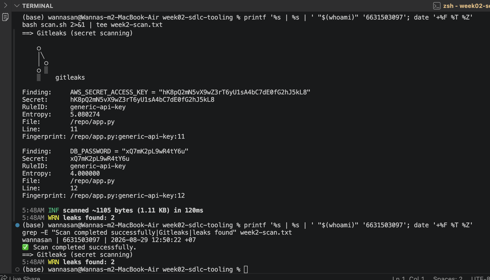

**Task 1 — SAST sweep with Semgrep (25 min)** · *Goal:* find code flaws. *Steps:* read the Semgrep output; locate the SQL injection in `/user` (CWE-89, string-formatted query), the OS command injection in `/ping` (CWE-78, `shell=True`), the weak `md5` password hash (CWE-327), and `debug=True` (CWE-489). *Deliverable:* one screenshot per finding with the file:line.

Semgrep identified four unique weaknesses in the original `app.py`: SQL injection at lines 19–20, OS command injection at line 26, MD5 password hashing at line 30, and Flask debug mode at line 33. The SQL and subprocess issues produced duplicate warnings from multiple rules, so I treat each root cause as one vulnerability.

Mitigations are to parameterize the SQL query, pass a fixed subprocess argument list without a shell, use a password-specific hash such as Argon2, and disable debug mode in production.

**Source-code evidence**

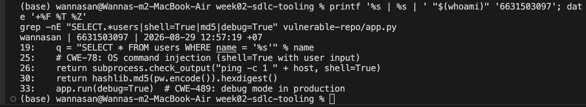

**Semgrep evidence — SQL injection and command injection**

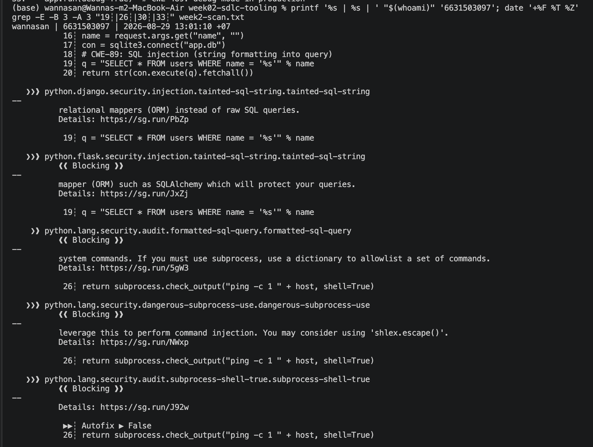

**Semgrep evidence — command injection, MD5, and debug mode**

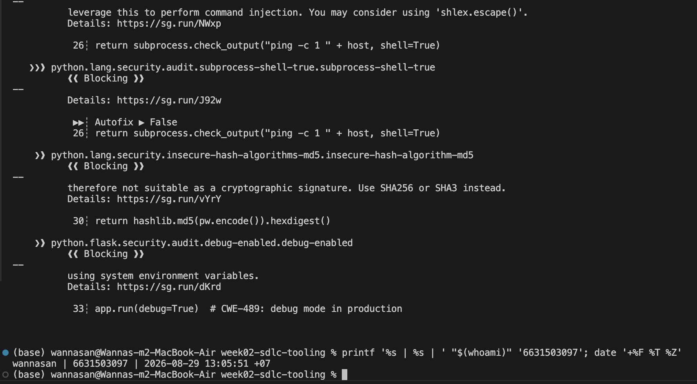

**Task 2 — Secret scan with Gitleaks (15 min)** · *Goal:* find leaked credentials. *Steps:* read the Gitleaks output; identify `AWS_SECRET_ACCESS_KEY` and `DB_PASSWORD` (CWE-798). *Deliverable:* screenshot + the rule that fired for each.

Gitleaks reported `AWS_SECRET_ACCESS_KEY` at `app.py:11` and `DB_PASSWORD` at `app.py:12`. Both findings used the `generic-api-key` rule and map to CWE-798 because credentials were stored directly in source code. The fix is to remove the values from the repository and load them from environment variables or a secret manager; any real exposed credential would also need rotation.

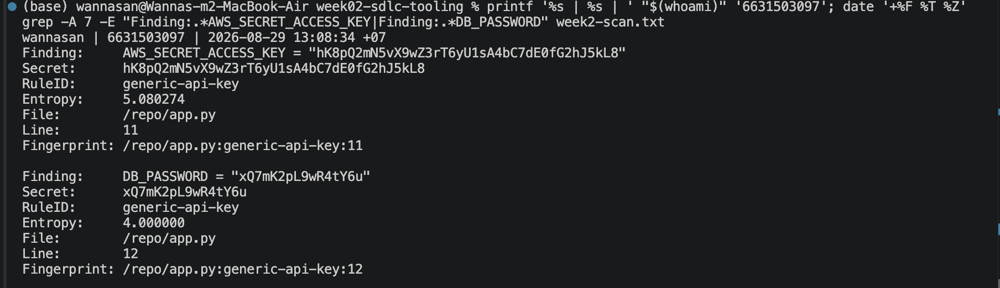

**Task 3 — Bug Triage Race (30 min)** · *Goal:* triage accurately. *Steps:* build a table with columns *Tool | File:Line | CWE | Severity | TP/FP | Fix idea*; mark at least 3 true positives and 1 likely false positive and justify each. (Score = TP − misclassified.) *Deliverable:* the completed triage table.

The file and line numbers below refer to the original vulnerable version that produced `week2-scan.txt`.

| Tool | File:Line | CWE | Severity | TP/FP | Fix idea |
|---|---|---|---|---|---|
| Semgrep | `app.py:19-20` | CWE-89 SQL Injection | High | TP | Use a parameterized query. |
| Semgrep | `app.py:26` | CWE-78 OS Command Injection | High | TP | Remove `shell=True`, validate the host, and pass arguments as a list. |
| Semgrep | `app.py:30` | CWE-327 Weak Cryptography | Medium | TP | Replace MD5 with Argon2 or bcrypt. |
| Semgrep | `app.py:33` | CWE-489 Debug Code | Medium | TP | Disable debug mode in production. |
| Gitleaks | `app.py:11` | CWE-798 Hardcoded Credentials | High | TP | Load the value from an environment variable or secret manager and rotate any real exposed key. |
| Gitleaks | `app.py:12` | CWE-798 Hardcoded Credentials | High | TP | Load the value from an environment variable or secret manager and rotate any real exposed password. |
| Semgrep | `app.py:19-20` | CWE-89 SQL Injection | Low | Likely FP/duplicate for unique-bug counting | Multiple rules identify the same underlying SQL-injection vulnerability, so do not count each rule as a separate unique bug. |

The true positives map directly to insecure code in the original `app.py`. The last row is not a wrong scanner alert—the SQL injection is real—but it is a likely false positive if someone counts the duplicate rule match as another separate vulnerability.

**Task 4 — Fuzzing intro (10 min)** · *Goal:* see coverage-guided fuzzing find a bug SAST won't. *Steps:* in the `labs/toolbox` container (Apple clang has no libFuzzer runtime), build `clang -g -fsanitize=address,fuzzer harness.c -o fuzz`, then **seed the corpus** and run it:
`mkdir -p corpus && printf 'FUZ' > corpus/seed && ./fuzz corpus`. It crashes almost immediately with an AddressSanitizer heap-buffer-overflow at `harness.c:23` (the `data[3]` read with no `size > 3` check). Seeding matters: an unseeded `./fuzz` has to rediscover the magic bytes by chance and often finds nothing for minutes — that unpredictability is itself worth a sentence in your write-up. (The deep fuzzing+exploit lab is Week 11.) *Deliverable:* the ASan crash output (or a screenshot) + a 2-sentence note on why fuzzing finds this bug when a linter/SAST pass over the same 4-line check would not.

The seeded libFuzzer run was completed inside the toolbox container with `FUZ` in the seed corpus. AddressSanitizer reported a heap-buffer-overflow at `harness.c:23:21` in `LLVMFuzzerTestOneInput`; the crash input was `FUZ`, and the reproducer was `crash-0eb8e4ed029b774d80f2b66408203801cb982a60`.

LibFuzzer found a heap-buffer-overflow because the code reads data[3] even when the input contains only three bytes (FUZ). Coverage-guided fuzzing executes real inputs and observes runtime memory errors, so it can expose this boundary bug even when a pattern-based static scan does not report it.

**Task 4 fuzzing evidence**

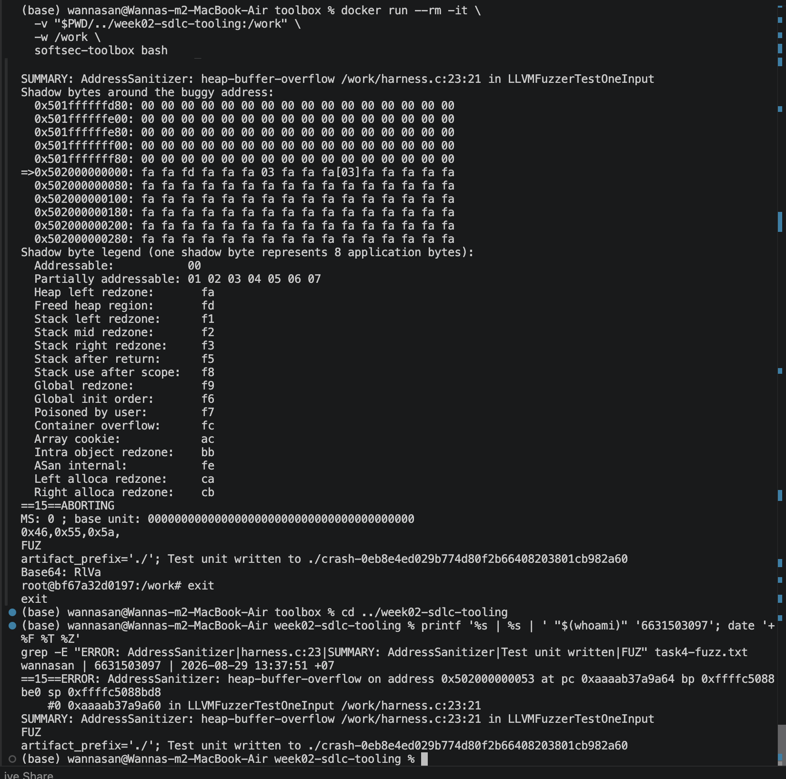

**Task 5 — Scan the project target (40 min)** · *Goal:* apply the tools to your term project. *Steps:* run Semgrep + Gitleaks against **NoteVault** (`../../project/starter-app`); also run an SCA scan: `docker run --rm -v "$PWD/../../project/starter-app:/src" aquasec/trivy fs /src`. *Deliverable:* a findings list (tool, file:line/CVE, CWE) — reuse it in your project vuln report.

The completed manual scans produced these results:

| Tool | Result |
|---|---|
| Semgrep | 27 findings |
| Gitleaks | No leaks found |
| Trivy | 32 dependency vulnerabilities: 2 LOW, 18 MEDIUM, 12 HIGH, and 0 CRITICAL |

Important Semgrep findings included:

| File:Line | Finding | CWE | Fix idea |
|---|---|---|---|
| `app.py:83` | JWT accepts the `none` algorithm | CWE-347 | Remove `none` and allow only the expected signed algorithm. |
| `app.py:117`, `app.py:129` | MD5 password hashing | CWE-327 | Use a password-hashing function such as bcrypt or Argon2. |
| `app.py:128-130`, `app.py:178-179` | SQL injection | CWE-89 | Use parameterized SQL queries. |
| `app.py:136` | Insecure session cookie settings | CWE-614 / CWE-1004 | Set appropriate `Secure`, `HttpOnly`, and `SameSite` cookie attributes. |
| `app.py:202-203` | Command injection | CWE-78 | Avoid shell command construction and pass arguments safely without a shell. |
| `app.py:209` | Flask debug mode enabled | CWE-489 | Disable debug mode outside development. |

Representative HIGH-severity Trivy findings were:

| Package | CVE | Severity |
|---|---|---|
| Flask | CVE-2023-30861 | HIGH |
| PyJWT | CVE-2022-29217 | HIGH |
| Werkzeug | CVE-2023-25577 | HIGH |
| urllib3 | CVE-2021-33503 | HIGH |

**Semgrep evidence**

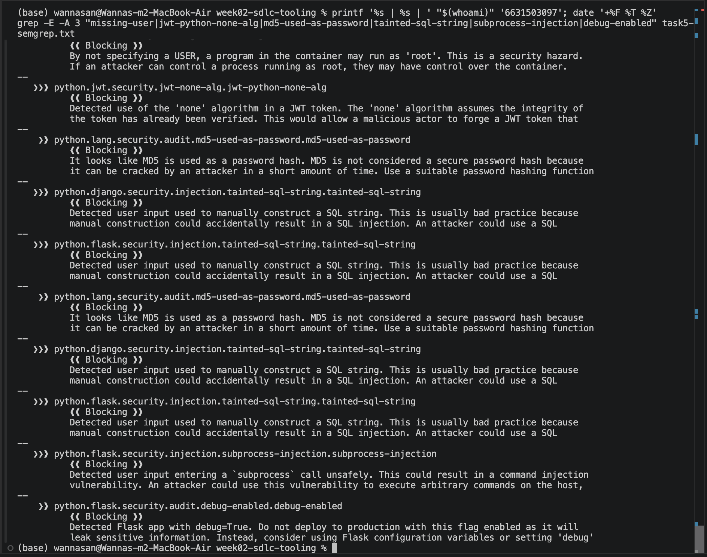

**Gitleaks evidence**

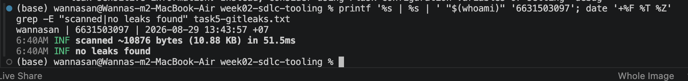

**Trivy evidence**

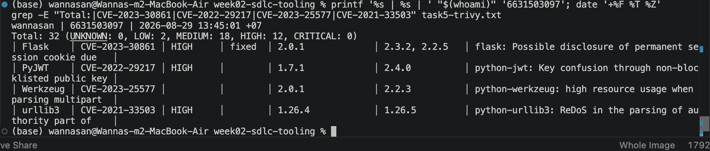

**Task 6 — Build a security CI gate (25 min)** · *Goal:* automate the scan (previews Week 15). *Steps:* adapt `../week15-devsecops-pipeline/security-ci.yml` into a workflow that runs Semgrep + Trivy + Gitleaks and **fails on HIGH/CRITICAL**; run it locally (`act`) or commit to your fork and read the Actions log. *Deliverable:* the workflow file + a screenshot of a failing run.

The provided Week 15 template has separate Semgrep, Trivy, and Gitleaks jobs. Its report steps preserve SARIF output, while later gate steps use non-zero exit codes so findings can fail the build. For Week 2, the adapted workflow must scan the intended target rather than inherit the repository's existing workflow exclusions for deliberately vulnerable lab directories.

The Week 2 workflow is implemented at `.github/workflows/week02-security-ci.yml`. It scans `project/starter-app` with Semgrep, Gitleaks, and Trivy; the Semgrep job copies only that target to the runner's temporary directory so the repository-level teaching-lab exclusion cannot skip it. Semgrep and Gitleaks preserve non-zero scanner exit codes, while Trivy uses `severity: HIGH,CRITICAL` with `exit-code: "1"` so those dependency or configuration findings fail the job.

GitHub Actions run #2 of **Week 2 Security CI** produced the following results:

| Job | Result |
|---|---|
| SAST (Semgrep) | Failed |
| Secret scanning (Gitleaks) | Passed |
| SCA and configuration scanning (Trivy) | Failed |

Trivy successfully scanned `project/starter-app`. It reported `DS-0002` (HIGH) because the Dockerfile does not specify a non-root `USER`, and `DS-0031` (CRITICAL) for possible exposure of `APP_SECRET` through `ENV` at `Dockerfile:5`. The Trivy job finished with `Process completed with exit code 1`, showing that the HIGH/CRITICAL gate worked.

**GitHub Actions evidence**

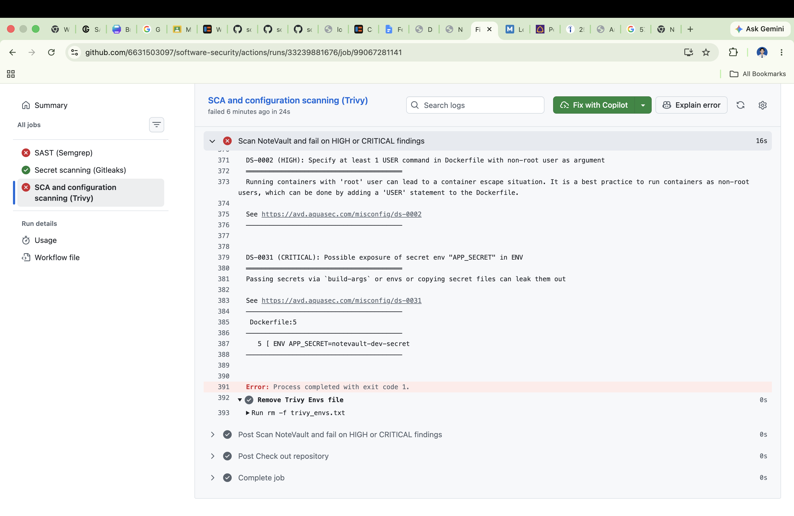

**Task 7 — SAST blind spots (20 min)** · *Goal:* see what scanners miss. *Steps:* find one real bug in `vulnerable-repo/app.py` (or NoteVault) that Semgrep did **not** flag, and explain why a pattern-based tool missed it. *Deliverable:* the bug + a 2-sentence explanation.

The hardcoded `AWS_SECRET_ACCESS_KEY` and `DB_PASSWORD` in the original `vulnerable-repo/app.py:11-12` are real CWE-798 weaknesses that this Semgrep run did not report, even though Gitleaks found both. The Semgrep rules used here focus mainly on code patterns and data flow, while Gitleaks uses secret-oriented rules and entropy checks, so the tools cover different blind spots.

**Task 8 — Defend / fix it (10 min)** · *Goal:* remediate the planted flaws in `vulnerable-repo/app.py`. *Steps:* rewrite `/user` to use a parameterized query (`?` placeholder); remove `shell=True` and pass an argument list in `/ping`; move both secrets to environment variables; replace `md5` with bcrypt/argon2; set `debug=False`. *Deliverable:* a before/after diff for each fix mapped to its CWE.

I prepared the required fixes in `vulnerable-repo/app.py` and added `argon2-cffi` to its requirements:

```diff
-import sqlite3, hashlib, subprocess
+import ipaddress
+import os
+import sqlite3
+import subprocess
+from argon2 import PasswordHasher

-AWS_SECRET_ACCESS_KEY = "<hardcoded value>"
-DB_PASSWORD = "<hardcoded value>"
+AWS_SECRET_ACCESS_KEY = os.environ.get("AWS_SECRET_ACCESS_KEY")
+DB_PASSWORD = os.environ.get("DB_PASSWORD")
+PASSWORD_HASHER = PasswordHasher()

-q = "SELECT * FROM users WHERE name = '%s'" % name
-return str(con.execute(q).fetchall())
+rows = con.execute("SELECT * FROM users WHERE name = ?", (name,)).fetchall()
+return str(rows)

-return subprocess.check_output("ping -c 1 " + host, shell=True)
+ipaddress.ip_address(host)  # invalid input returns HTTP 400
+return subprocess.check_output(["ping", "-c", "1", host], text=True)

-return hashlib.md5(pw.encode()).hexdigest()
+return PASSWORD_HASHER.hash(pw)

-app.run(debug=True)
+app.run(debug=False)
```

- **CWE-89:** the query structure is fixed and `name` is supplied separately as a SQLite parameter.
- **CWE-78:** the endpoint accepts only a valid IP address and invokes `ping` with an argument list instead of a shell command string.
- **CWE-798:** secret values are no longer stored in source and must come from the environment.
- **CWE-327:** Argon2 provides a salted, password-specific hash instead of fast MD5.
- **CWE-489:** Flask debug mode is disabled.

The fixed app was tested locally. The `/user` route uses a parameterized query; `/ping` validates the host as an IP address and invokes `ping` without `shell=True`; secrets are loaded from environment variables; password hashing uses Argon2; and Flask runs with `debug=False`.

The final rescans produced:

| Tool | Verified result |
|---|---|
| Semgrep | 0 findings, 0 blocking, 2 files scanned |
| Gitleaks | No leaks found |

**Task 8 rescan evidence**

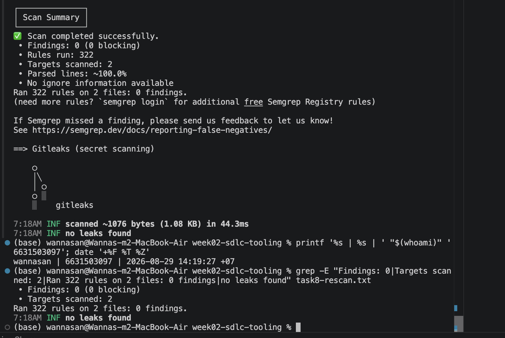

## Part 4 — Reflection
1. Map two of your findings to their CWE and to the matching OWASP 2025 category.

   **Answer:** The string-built query is CWE-89 SQL Injection and maps to OWASP 2025 A05 Injection because untrusted request data changes the SQL command. The hardcoded AWS key and database password are CWE-798 and map to OWASP 2025 A02 Security Misconfiguration because sensitive credentials are stored in application source instead of protected configuration.

2. Name a real-world breach caused by a hardcoded/leaked secret or an injection flaw, and what control would have caught it pre-release.

   **Answer:** In Uber's 2016 data breach, attackers used previously exposed passwords to access Uber's private GitHub repository, found a plaintext AWS access key, and used it to download data from Amazon S3, as documented by the [FTC](https://www.ftc.gov/system/files/documents/federal_register_notices/2018/04/152_3054_uber_revised_consent_analysis_pub_frn.pdf). Secret scanning in CI could have detected the committed key before release. MFA, unique credentials, key rotation, least-privilege access, and a secret manager would also have reduced the likelihood and impact of this hardcoded-secret exposure.

3. Which single tool (SAST vs. secret scanning) gave the highest-value findings on this repo, and why?

   **Answer:** Semgrep gave the highest overall value on this small repository because it found four different executable-code weaknesses: SQL injection, command injection, MD5 hashing, and debug mode. Gitleaks was still necessary because it found the two hardcoded credentials that this Semgrep run missed.

## Grading rubric (100)
| Criterion | Points |
|---|---|
| Lecture questions (Part 2) | 20 |
| Exploitation + evidence (scan output + triage table + screenshots) | 40 |
| Defense (remediated `app.py` with before/after diffs) | 25 |
| Reflection (CWE/OWASP mapping + breach + tool value) | 15 |

---

## Evidence & Integrity (required)

- **Identity proof:** every screenshot/diagram must show a terminal running `printf '%s | %s | ' "$(whoami)" '<YOUR-STUDENT-ID>'; date '+%F %T %Z'` **in the
  same image as the evidence**. When the evidence is a browser page, a DevTools panel or a
  rendered response, put that terminal **beside the browser and capture the whole screen** — a
  cropped window carries nothing that identifies you, and the lab's own output is
  byte-identical for the whole cohort *by design*, so the stamp is the only thing that makes
  the shot yours. Generic or borrowed evidence is not accepted.
- **Personalized flag (if this lab issues one):** N/A — no personalized flag is issued for Week 2 according to the Week 2 course materials.
  *Flags are unique per student — submitting another student's flag is a violation. How to submit: **learn.zcr.ai/submit** (full guide: `SUBMISSION.md` in the repo root).*
- **Explain in your own words** *(graded on your reasoning, not copied text):*
  1. What did you do, and **why did the vulnerability work**?
  2. **Why does your fix actually stop it** — and what could still break it?

**Evidence status**

- Task 0 scan execution: `image-task0-scan.png`
- Task 1 source and Semgrep findings: `image-task1-code.png`, `image-task1-semgrep-1.png`, and `image-task1-semgrep-2.png`
- Task 2 Gitleaks findings: `image-task2-gitleaks.png`
- Task 3 triage: based on the saved `week2-scan.txt` output and the Task 1–2 evidence above
- Task 4 fuzzing: `image-task4-fuzzing.png`; reproducer `crash-0eb8e4ed029b774d80f2b66408203801cb982a60`
- Task 5 NoteVault scans: `image-task5-semgrep.png`, `image-task5-gitleaks.png`, and `image-task5-trivy.png`
- Task 6 CI workflow/run: `.github/workflows/week02-security-ci.yml` and `image-task6-ci.png`
- Task 8 runtime and rescan: manually verified; `image-task8-rescan.png`
- Commit hash: TODO-MANUAL-COMMIT-HASH

**Explain in my own words:** I ran static and secret scans against the provided lab target, then grouped duplicate warnings by their real root cause. The SQL injection worked because the original `/user` endpoint placed the request's `name` value directly into SQL text, so input could change the meaning of the query.

The parameterized query sends the SQL structure and data separately, and the other fixes remove shell interpretation, hardcoded secrets, MD5, and debug mode. The fixed app was tested locally, and the final Semgrep and Gitleaks rescans are recorded in `image-task8-rescan.png`; controls such as dependency updates, authorization, logging, and deployment configuration remain outside these five fixes.

---

## 🤖 Audit the AI (required)

AI is a power tool you must **distrust** — you are graded on your *critique*, not the AI's answer.

1. Ask an AI assistant to exploit **or** fix this week's vulnerability. Paste its full answer.
2. **Find what's wrong or risky** in it — insecure code, a subtly incomplete fix, a hallucinated API/function/CVE, a missed edge case, or wrong reasoning. Quote the exact line(s).
3. Produce the **correct, verified** version yourself and explain in 2–3 sentences why the AI's output was insufficient.

> Disclose your AI use in the Part 1 table. This task counts toward your **Defense + Reflection** score.

### AI answer used

Below is a proposed replacement based on the vulnerabilities and endpoint behavior described in the worksheet. It assumes the password endpoint is `/hash`; that route name should be checked against the original file before applying it.

```python
import ipaddress
import os
import sqlite3
import subprocess

from argon2 import PasswordHasher
from flask import Flask, jsonify, request

app = Flask(__name__)
password_hasher = PasswordHasher()


def required_secret(name):
    value = os.environ.get(name)
    if not value:
        raise RuntimeError(f"Required environment variable {name} is not set")
    return value


AWS_SECRET_ACCESS_KEY = required_secret("AWS_SECRET_ACCESS_KEY")
DB_PASSWORD = required_secret("DB_PASSWORD")


@app.get("/user")
def get_user():
    name = request.args.get("name", "")

    with sqlite3.connect("users.db") as connection:
        rows = connection.execute(
            "SELECT * FROM users WHERE name = ?",
            (name,),
        ).fetchall()

    return jsonify(rows)


@app.get("/ping")
def ping():
    host = request.args.get("host", "")

    try:
        validated_host = str(ipaddress.ip_address(host))
    except ValueError:
        return jsonify({"error": "host must be a valid IP address"}), 400

    try:
        result = subprocess.run(
            ["ping", "-c", "1", validated_host],
            capture_output=True,
            text=True,
            timeout=5,
            check=True,
        )
    except subprocess.TimeoutExpired:
        return jsonify({"error": "ping timed out"}), 504
    except subprocess.CalledProcessError:
        return jsonify({"error": "host did not respond"}), 502

    return jsonify({"output": result.stdout})


@app.post("/hash")
def hash_password():
    password = request.form.get("password", "")

    if not password:
        return jsonify({"error": "password is required"}), 400

    return jsonify({"hash": password_hasher.hash(password)})


if __name__ == "__main__":
    app.run(debug=False)
```

Why the changes are secure:

- `/user` uses SQLite’s `?` placeholder and passes `name` separately. User input cannot alter the SQL structure.
- `/ping` accepts only a valid IP address and passes arguments as a list without `shell=True`. Shell metacharacters are therefore neither accepted nor interpreted.
- Secrets come from environment variables, so credentials are not committed in source code. The application fails closed if either variable is missing.
- Argon2 is a password-specific, salted, deliberately expensive hashing algorithm. It is substantially safer for passwords than fast MD5.
- `debug=False` prevents Flask’s interactive debugger from being exposed.
- The ping operation also has a timeout and controlled error responses, reducing resource-exhaustion and information-disclosure risks.

### What was wrong or risky

The risky part of the AI answer is that it changed parts of the application that were not part of the security fix. It says, “It assumes the password endpoint is /hash,” even though the original Week 2 app has a store\_password(pw) function rather than a /hash route. It also changed the SQLite database name from app.db to users.db. These changes could break the existing application even though the security ideas themselves are mostly correct.

### Correct verified version

The verified fix keeps the original application structure and changes only the insecure behavior. The /user route uses a parameterized SQLite query against app.db, /ping validates the IP address and passes an argument list without shell=True, secrets are loaded from environment variables, store\_password() uses Argon2 instead of MD5, and Flask runs with debug=False. The fixed code was then rescanned with Semgrep and Gitleaks, which reported 0 Semgrep findings and no leaked secrets.

---

## 🧠 Comprehension & Prompt (required)

**A. Explain in Plain English (EiPE).** In 2–3 sentences, in your own words, describe what this week's vulnerable code/endpoint actually *does* and *why it is exploitable* — explain the mechanism, don't dump jargon.

The `/user` endpoint reads a name from the URL and uses it to look up matching database rows. The original version joined that name directly into the SQL command, so specially chosen input could change the query instead of being treated only as a name. A parameterized query keeps the input separate from the command.

**B. Prompt Problem.** Write a **single prompt** that makes an AI produce a *correct, secure* fix for one finding. Run it: does the exploit now fail? If not, refine the prompt and try again. Submit the **final prompt + the verified result**.
*Graded on the prompt's precision and your verification — this trains problem decomposition and AI literacy (Denny et al. 2024).*

**Final prompt:**

> Inspect the exact current code in `labs/week02-sdlc-tooling/vulnerable-repo/app.py`. Make a minimal fix for the CWE-89 SQL injection in `/user` by using SQLite's `?` parameter placeholder and passing `name` as a separate one-element tuple. Preserve the endpoint's normal response behavior, close the database connection safely, do not build SQL with formatting or concatenation, and do not change unrelated routes. Show the exact diff and provide a small local verification for both a normal name and an SQL-like input, clearly separating automated output from identity-stamped manual evidence.

**Verified result:** The fixed app was tested locally with the `/user` parameterized query and the other Task 8 controls in place. The final Semgrep rescan reported 0 findings, 0 blocking, and 2 files scanned, while Gitleaks reported no leaks; see `image-task8-rescan.png`.
