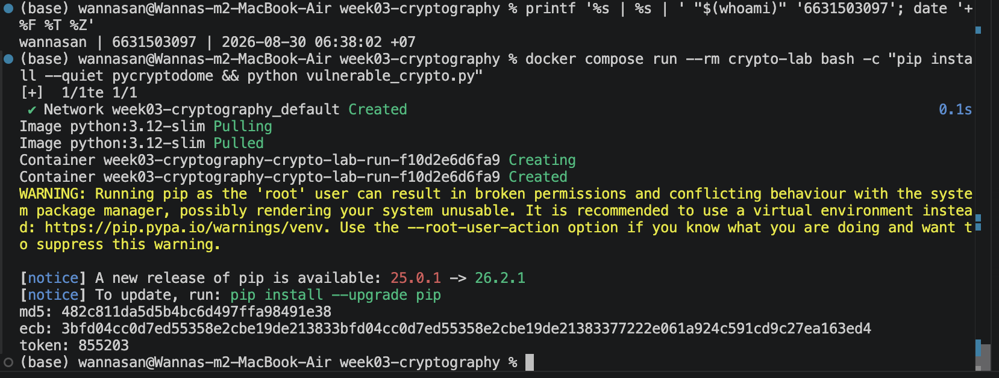
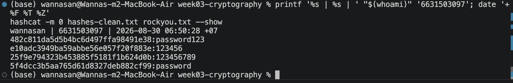
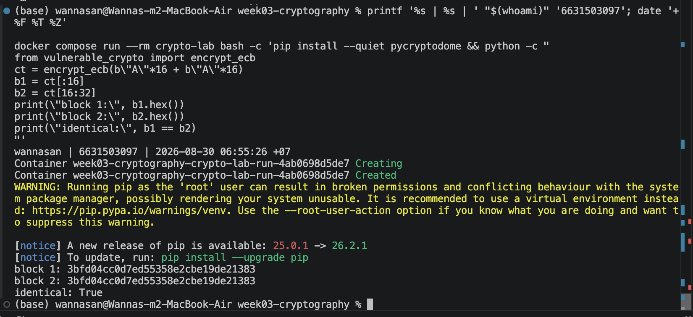
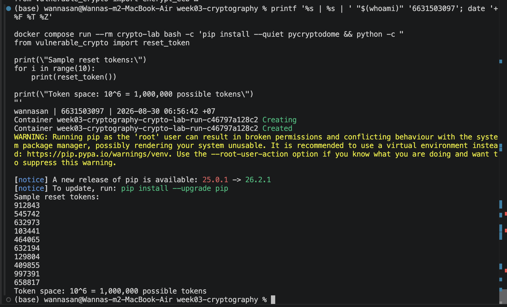
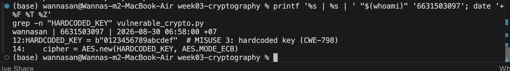
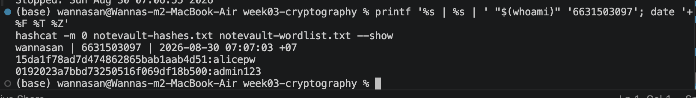
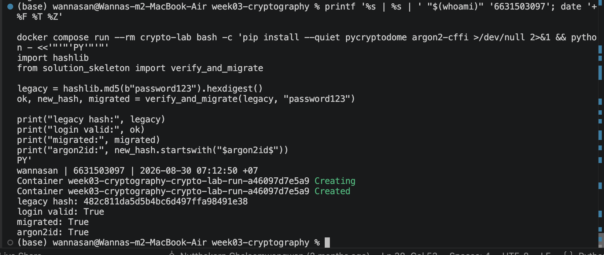
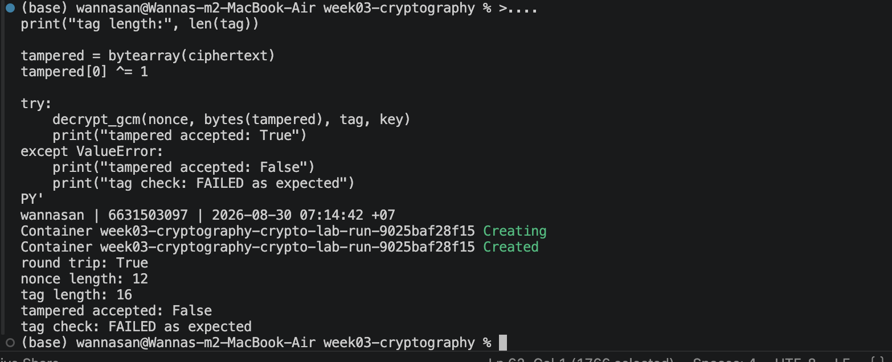
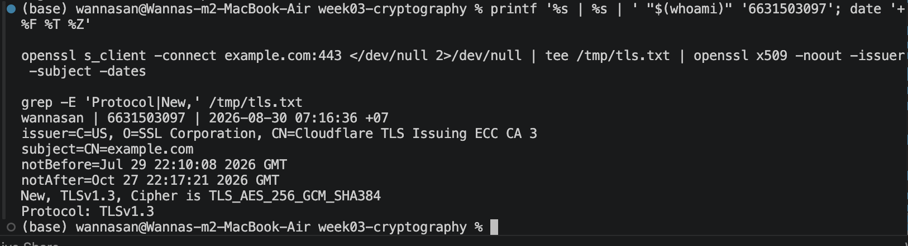
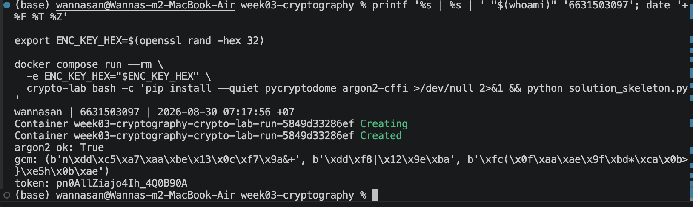

# Worksheet 3 — Cryptography Used Correctly (and Misused) (3 hrs)

> **Course:** Software Security (KOSEN69) · **Week 3**
> **Aligned to:** OWASP 2025 A04 Cryptographic Failures · CWE-327, CWE-916, CWE-330, CWE-798
> **Signature game:** "Capture the Hash" (recover plaintext from weak hashes)

> **Ethics note:** Crack only the hashes provided in `hashes.txt` on your own machine. Password-cracking against accounts or systems you don't own is illegal. Wordlists and recovered values stay inside the lab VM.

## Part 1 — Student Information
| Name | Student ID | Date | Group |
|---|---|---|---|
| Wanna-San | 6631503097 | 2026-08-30 | - |

**AI-use disclosure:** AI was used for drafting, code review, and structuring answers. Runtime execution, evidence capture, and verification were completed manually by the student.

## Part 2 — Lecture Questions
Answer in your own words (2–4 sentences each).
1. Distinguish hashing, encryption, and encoding — and give one job each is the wrong tool for.

   **Answer:** Hashing creates a one-way digest, encryption transforms data so it can be recovered with a key, and encoding changes the representation of data for compatibility. Hashing is wrong for data that must be recovered, encryption is wrong for password storage, and encoding is wrong when confidentiality is required.

2. Why is a fast hash like MD5/SHA-1 a bad choice for storing passwords, and what should be used instead?

   **Answer:** MD5 and SHA-1 are fast, so an attacker can test a very large number of password guesses cheaply after stealing a hash database. Passwords should instead be stored with a dedicated password-hashing function such as Argon2id, which automatically salts hashes and deliberately uses more time and memory.

3. What is a salt, what attack does it defeat, and why must it be unique per password?

   **Answer:** A salt is a random value combined with a password before hashing and stored beside the result. A unique salt prevents useful precomputed rainbow tables and makes equal passwords produce different hashes; reusing one salt would allow attackers to reuse work and identify accounts with matching passwords.

4. Why does AES-ECB leak structure, and what does an authenticated mode like AES-GCM add?

   **Answer:** ECB encrypts each block independently and deterministically, so identical plaintext blocks produce identical ciphertext blocks and reveal patterns. AES-GCM uses a unique nonce and also produces an authentication tag, providing confidentiality while detecting modification of the ciphertext.

5. What's the difference between `random` and a CSPRNG (e.g. `secrets`), and where does it matter?

   **Answer:** Python's `random` is designed for simulation and can be predictable from its internal state, while a CSPRNG such as `secrets` draws from operating-system entropy and is intended to resist prediction. A CSPRNG matters for reset tokens, session identifiers, encryption keys, and nonces.


## Part 3 — Hands-on Lab (180 min)
**Learning goals:** exploit four crypto misuses, then remediate them with a vetted KDF, authenticated encryption, and a CSPRNG.
**Prerequisites:** Docker (or local Python 3.12); `hashcat` or `john`; the `rockyou.txt` wordlist.

**Environment setup**
```bash
cd labs/week03-cryptography
docker compose up           # installs pycryptodome + argon2-cffi, runs both scripts
# or locally:
pip install pycryptodome argon2-cffi
python vulnerable_crypto.py # see the md5 hash, repeated ECB blocks, 6-digit token
```
Targets: `vulnerable_crypto.py` (the misuses), `hashes.txt` (four unsalted MD5s), and `solution_skeleton.py` (the fix).

**What to submit per task:** the command/payload run + a screenshot of the result + a 2–3 sentence mitigation.

**Task 0 — Onboarding (5 min)** · *Goal:* see the misuse output. *Steps:* run `python vulnerable_crypto.py`; note the md5 digest, the identical ECB ciphertext blocks, and the short token. *Deliverable:* screenshot of the program output.

I ran `vulnerable_crypto.py` inside the Docker lab. The output showed an MD5 digest, repeated AES-ECB ciphertext blocks, and a six-digit token, confirming the three visible misuse examples.



**Task 1 — Capture the Hash (30 min)** · *Goal:* recover the passwords. *Steps:* strip the comment lines from `hashes.txt`, then run `hashcat -m 0 hashes.txt rockyou.txt` (or the `john --format=raw-md5` equivalent); recover all four plaintexts. *Deliverable:* screenshot of the cracked results (mask any real-looking value). Note in one line why unsalted MD5 fell so fast (CWE-916/327).

| MD5 hash | Recovered plaintext |
|---|---|
| `482c811da5d5b4bc6d497ffa98491e38` | `password123` |
| `e10adc3949ba59abbe56e057f20f883e` | `123456` |
| `25f9e794323b453885f5181f1b624d0b` | `123456789` |
| `5f4dcc3b5aa765d61d8327deb882cf99` | `password` |

Hashcat mode 0 recovered all four values. Unsalted MD5 fell quickly because it is a fast general-purpose hash, so each dictionary guess is cheap and the same plaintext always produces the same digest (CWE-916/CWE-327). The mitigation is Argon2id with its automatic unique salt and suitable time and memory costs.



```sim
aes-modes
```

**Task 2 — ECB structure leak (20 min)** · *Goal:* prove ECB leaks. *Steps:* call `encrypt_ecb(b"A"*16 + b"A"*16)` from `vulnerable_crypto.py` and show the two 16-byte ciphertext blocks are identical; explain how this leaks plaintext structure (CWE-327). *Deliverable:* hex output highlighting the repeated block.

The two ciphertext blocks were both `3bfd04cc0d7ed55358e2cbe19de21383`, and the comparison returned `True`. ECB maps equal plaintext blocks to equal ciphertext blocks, revealing repeated structure even though the plaintext content is encrypted. AES-GCM with a fresh nonce avoids this deterministic block pattern and adds integrity protection.



**Task 3 — Predictable token (15 min)** · *Goal:* show the reset token is guessable. *Steps:* call `reset_token()` repeatedly; argue why a 6-digit `random` token (10^6 space, non-CSPRNG) is brute-forceable (CWE-330). *Deliverable:* sample tokens + a one-line attack estimate.

Repeated calls produced six-digit numeric reset tokens, as shown in the evidence. The complete search space is only `10^6`, or 1,000,000 possible values, and `random` is not a CSPRNG, so guessing becomes realistic when the application has no strong rate limits. The fix is a longer token from `secrets`, plus expiry and rate limiting at the application layer.



**Task 4 — Hardcoded key (5 min)** · *Goal:* identify the key-management flaw. *Steps:* find `HARDCODED_KEY` in `vulnerable_crypto.py`; explain why shipping a key in source is CWE-798. *Deliverable:* the line + a 2-sentence mitigation.

The source contains `HARDCODED_KEY = b"0123456789abcdef"` and uses it for AES-ECB. Anyone who can read the source or repository can recover the same encryption key, and rotating a key embedded in released code is difficult (CWE-798). The key should come from a secret manager or protected environment variable, have limited access, and support rotation without a code change.



**Task 5 — Crack the project target's hashes (25 min)** · *Goal:* apply cracking to your term project. *Steps:* **NoteVault** stores unsalted MD5 password hashes; obtain them (via the app's `/admin` once you can reach it, or from its `seed()`), and crack them with `hashcat -m 0`. *Deliverable:* the recovered password(s) + note the CWE — record this finding for your project report (`project/REPORT-TEMPLATE.md` in the repo root).

| NoteVault MD5 hash | Recovered plaintext | Method |
|---|---|---|
| `15da1f78ad7d474862865bab1aab4d51` | `alicepw` | Seeded candidate checked with Hashcat |
| `0192023a7bbd73250516f069df18b500` | `admin123` | Recovered directly with RockYou |

The hashes and expected seed accounts are present in NoteVault's `seed()` code. Storing passwords as unsalted MD5 is CWE-916/CWE-327 because an attacker can run fast offline guesses, so this finding should also be recorded in the NoteVault project report. Argon2id with a unique salt and a rehash-on-login migration is the appropriate fix.



**Task 6 — Password storage migration (25 min)** · *Goal:* fix it the way real apps do. *Steps:* write `store_password`/`verify_password` with **argon2id**, and a **rehash-on-login** path that upgrades a legacy MD5 record to argon2id the next time the user logs in. *Deliverable:* the code + a short note on why migration matters.

```python
ph = PasswordHasher()

def store_password(pw: str) -> str:
    return ph.hash(pw)

def verify_password(hash_: str, pw: str) -> bool:
    try:
        return ph.verify(hash_, pw)
    except Exception:
        return False

def verify_and_migrate(stored_hash: str, pw: str) -> tuple[bool, str, bool]:
    if stored_hash.startswith("$argon2"):
        return verify_password(stored_hash, pw), stored_hash, False

    legacy_md5 = hashlib.md5(pw.encode()).hexdigest()
    if hmac.compare_digest(legacy_md5, stored_hash):
        new_hash = store_password(pw)
        return True, new_hash, True

    return False, stored_hash, False
```

`store_password()` now calls Argon2's password hasher, and `verify_password()` verifies the encoded Argon2 value. `verify_and_migrate()` recognizes an existing Argon2 hash; otherwise it compares the legacy MD5 with `hmac.compare_digest` and, after a valid login, returns a new Argon2id hash for storage.

| Manual migration check | Result |
|---|---|
| Legacy MD5 | `482c811da5d5b4bc6d497ffa98491e38` |
| Login valid | `True` |
| Migrated | `True` |
| New hash is Argon2id | `True` |

Migration matters because forcing every user to reset a password at once is disruptive, while leaving old MD5 records indefinitely preserves the original risk. Rehash-on-login upgrades a verified account gradually without ever needing to recover or store its plaintext password.



**Task 7 — Authenticated encryption round-trip (20 min)** · *Goal:* use AEAD correctly. *Steps:* encrypt+decrypt a message with **AES-GCM** using a random 12-byte nonce and a key from an env var; then flip one ciphertext byte and show decryption **fails** (tag check). *Deliverable:* the round-trip output + the tampered-fails proof.

| AES-GCM check | Result |
|---|---|
| Round trip | `True` |
| Nonce length | 12 bytes |
| Tag length | 16 bytes |
| Tampered ciphertext accepted | `False` |
| Tag check | Failed as expected |

`decrypt_gcm()` uses `decrypt_and_verify`, so changing one ciphertext byte makes tag verification fail instead of returning altered plaintext. This is the important difference from encryption without authentication: GCM detects tampering as long as the nonce is never reused with the same key and the key remains secret.



**Task 8 — TLS in practice (15 min)** · *Goal:* read a real cert. *Steps:* run `openssl s_client -connect example.com:443 </dev/null 2>/dev/null | tee /tmp/tls.txt | openssl x509 -noout -issuer -subject -dates` for the cert summary, then `grep -E 'Protocol|New,' /tmp/tls.txt` for the negotiated TLS version (the version line is printed by `s_client`, not by `x509`, so the plain pipe would discard it); identify issuer, validity, and that TLS version. *Deliverable:* the cert summary + one line on what TLS protects that hashing/at-rest encryption does not.

| Field | Observed value |
|---|---|
| Issuer | `C=US, O=SSL Corporation, CN=Cloudflare TLS Issuing ECC CA 3` |
| Subject | `CN=example.com` |
| Valid from | `Jul 29 22:10:08 2026 GMT` |
| Valid until | `Oct 27 22:17:21 2026 GMT` |
| Protocol | TLS 1.3 |
| Cipher | `TLS_AES_256_GCM_SHA384` |

TLS protects data while it travels across the network and authenticates the peer through its certificate. Hashing is not a transport protocol, and at-rest encryption alone does not stop network interception or impersonation.



**Task 9 — Defend / fix it (20 min)** · *Goal:* remediate using `solution_skeleton.py`. *Steps:* run `python solution_skeleton.py`; confirm `store_password`/`verify_password` use argon2id (auto-salted), `encrypt_gcm` uses a random 12-byte nonce + auth tag with a key from `ENC_KEY_HEX` env, and `reset_token` uses `secrets`. Map each fix to the CWE it closes. *Deliverable:* before/after table (misuse → fix → CWE closed) + screenshot of the fixed script running.

| Before | Secure fix | CWE closed |
|---|---|---|
| Unsalted MD5 password hash | Argon2id with automatic salt and legacy migration | CWE-916 / CWE-327 |
| AES-ECB | AES-GCM with a random nonce and authentication tag | CWE-327 |
| Six-digit `random.choice` token | `secrets.token_urlsafe(16)` | CWE-330 |
| Hardcoded encryption key | Key supplied through `ENC_KEY_HEX` | CWE-798 |

The final script implements Argon2id storage and verification, legacy MD5 migration, AES-GCM encryption and authenticated decryption, a random 12-byte nonce, and a URL-safe token from `secrets`. In the manual run, `ENC_KEY_HEX` was generated outside the script and passed into the container; the output reported `argon2 ok: True`, printed the GCM tuple, and produced a secure URL-safe token.



## Part 4 — Reflection
1. Map each of the four misuses to its CWE and to OWASP A04, in one line each.

   - Unsalted MD5 password storage → CWE-916/CWE-327 → OWASP A04 Cryptographic Failures.
   - AES-ECB encryption → CWE-327 → OWASP A04 Cryptographic Failures.
   - Six-digit token from `random.choice` → CWE-330 → OWASP A04 Cryptographic Failures.
   - Hardcoded AES key → CWE-798 → OWASP A04 Cryptographic Failures.

2. Name a real-world breach caused by weak password hashing or hardcoded keys, and which fix here would have prevented it.

   In Uber's cloud-data breaches documented by the U.S. Federal Trade Commission, engineers stored cloud access keys in GitHub repositories, and attackers obtained an exposed key and used it to access cloud-stored consumer data. This relates directly to CWE-798 and Week 3's key-management lesson: access and encryption keys should be kept out of source repositories and securely injected and managed through protected environment variables or a secrets manager/KMS.

3. Across all four fixes, which closes the largest real-world risk, and why?

   For this application, replacing unsalted MD5 with Argon2id closes the largest risk because a stolen password database lets an attacker make unlimited offline guesses and recovered passwords may be reused on other services. Argon2id's unique salts and memory cost make each guess more expensive, while rehash-on-login also protects existing accounts over time.

## Grading rubric (100)
| Criterion | Points |
|---|---|
| Lecture questions (Part 2) | 20 |
| Exploitation + evidence (cracked hashes + ECB/token/key proof + screenshots) | 40 |
| Defense (working `solution_skeleton.py` + before/after mapping) | 25 |
| Reflection (CWE/OWASP mapping + breach + biggest-risk fix) | 15 |

---

## Evidence & Integrity (required)

- **Identity proof:** every screenshot/diagram must show a terminal running `printf '%s | %s | ' "$(whoami)" '<YOUR-STUDENT-ID>'; date '+%F %T %Z'` **in the
  same image as the evidence**. When the evidence is a browser page, a DevTools panel or a
  rendered response, put that terminal **beside the browser and capture the whole screen** — a
  cropped window carries nothing that identifies you, and the lab's own output is
  byte-identical for the whole cohort *by design*, so the stamp is the only thing that makes
  the shot yours. Generic or borrowed evidence is not accepted.
- **Personalized flag (if this lab issues one):** N/A — no personalized flag issued for Week 3 according to the Week 3 course materials.
  *Flags are unique per student — submitting another student's flag is a violation. How to submit: **learn.zcr.ai/submit** (full guide: `SUBMISSION.md` in the repo root).*
- **Explain in your own words** *(graded on your reasoning, not copied text):*
  1. What did you do, and **why did the vulnerability work**?
  2. **Why does your fix actually stop it** — and what could still break it?

**Evidence submitted:**

- Task 0: `image-task0-crypto.png`
- Task 1: `image-task1-hashcat.png`
- Task 2: `image-task2-ecb.png`
- Task 3: `image-task3-token.png`
- Task 4: `image-task4-hardcoded-key.png`
- Task 5: `image-task5-notevault-hashes.png`
- Task 6: `image-task6-migration.png`
- Task 7: `image-task7-gcm.png`
- Task 8: `image-task8-tls.png`
- Task 9: `image-task9-fixed.png`
- Commit hash: TODO-MANUAL-COMMIT-HASH

**My explanation:** I ran the vulnerable examples, recovered the supplied and NoteVault MD5 passwords, demonstrated ECB's repeated blocks, generated the small reset tokens, and located the source-code key. These attacks worked because MD5 permits cheap offline guesses, ECB deterministically exposes repeated blocks, the token has only one million possibilities and uses non-cryptographic randomness, and anyone with source access receives the same encryption key.

The fixes change the underlying security properties: Argon2id makes password guesses costly and uniquely salted, AES-GCM hides repeated structure and rejects modified ciphertext, `secrets` produces a longer unpredictable token, and external key injection removes the key from source. Security could still fail through weak Argon2 parameters, token endpoints without expiry or rate limits, nonce reuse, exposed environment variables, poor key rotation, or incorrect exception handling.

---

## 🤖 Audit the AI (required)

AI is a power tool you must **distrust** — you are graded on your *critique*, not the AI's answer.

1. Ask an AI assistant to exploit **or** fix this week's vulnerability. Paste its full answer.
2. **Find what's wrong or risky** in it — insecure code, a subtly incomplete fix, a hallucinated API/function/CVE, a missed edge case, or wrong reasoning. Quote the exact line(s).
3. Produce the **correct, verified** version yourself and explain in 2–3 sentences why the AI's output was insufficient.

> Disclose your AI use in the Part 1 table. This task counts toward your **Defense + Reflection** score.

### AI Answer Used

"Keep the existing MD5 hashes temporarily so current users can still log in. When a user logs in, hash the entered password with MD5 and compare it with the stored legacy hash. If it matches, immediately hash the plaintext password with PasswordHasher().hash() and replace the MD5 value in the database with the new Argon2id hash. For users who already have an Argon2 hash, verify it with PasswordHasher().verify(). After all active accounts have migrated, remove support for MD5."

### What Was Wrong or Risky

The answer correctly explains how to migrate a verified legacy MD5 password to Argon2id, which matches the migration tested in Task 6. However, it only calls `verify()` for an existing Argon2 hash and does not call `ph.check_needs_rehash(stored_hash)`, so a hash made with older or weaker parameters could remain unchanged after the application's settings improve. After successful Argon2 verification, the application should check whether rehashing is needed and, when it is, create a fresh value with `ph.hash(password)` and update the stored hash; this is an additional improvement and was not part of the manual MD5-to-Argon2 test.

### Correct Verified Version

The manually verified Task 6 result covers migration from legacy MD5 to Argon2id. A complete production approach should also call `ph.check_needs_rehash(stored_hash)` after a successful Argon2 verification and replace the stored value with `ph.hash(password)` when needed; this Argon2-parameter upgrade is a recommended correction, but it was not part of the manual Task 6 verification.

---

## 🧠 Comprehension & Prompt (required)

**A. Explain in Plain English (EiPE).** In 2–3 sentences, in your own words, describe what this week's vulnerable code/endpoint actually *does* and *why it is exploitable* — explain the mechanism, don't dump jargon.

**B. Prompt Problem.** Write a **single prompt** that makes an AI produce a *correct, secure* fix for one finding. Run it: does the exploit now fail? If not, refine the prompt and try again. Submit the **final prompt + the verified result**.
*Graded on the prompt's precision and your verification — this trains problem decomposition and AI literacy (Denny et al. 2024).*

**A. Explain in Plain English:** The vulnerable program stores passwords with fast, unsalted MD5, encrypts equal blocks into visible repeated patterns, creates short reset tokens with predictable-purpose randomness, and includes its AES key in source code. An attacker can therefore test password guesses cheaply, recognize ciphertext patterns, guess reset codes, or copy the key directly from the repository.

**B. Final prompt:**

> Inspect the existing `labs/week03-cryptography/solution_skeleton.py` and implement only its password-verification migration path. Preserve the current function names and return shape. Use Argon2id for new passwords; if a stored value begins with `$argon2`, verify it with `PasswordHasher.verify`; otherwise treat it as a legacy MD5 hex digest, compute the candidate digest, compare with `hmac.compare_digest`, and on a valid login return a new Argon2id hash with a `migrated=True` result. Do not log plaintext passwords or invent new routes. Include a minimal test using the legacy MD5 for `password123` that checks valid login, migration, and the `$argon2id$` prefix.

**Verified result:** The manual migration test returned `login valid: True`, `migrated: True`, and `argon2id: True` for legacy hash `482c811da5d5b4bc6d497ffa98491e38`, as shown in `image-task6-migration.png`.
