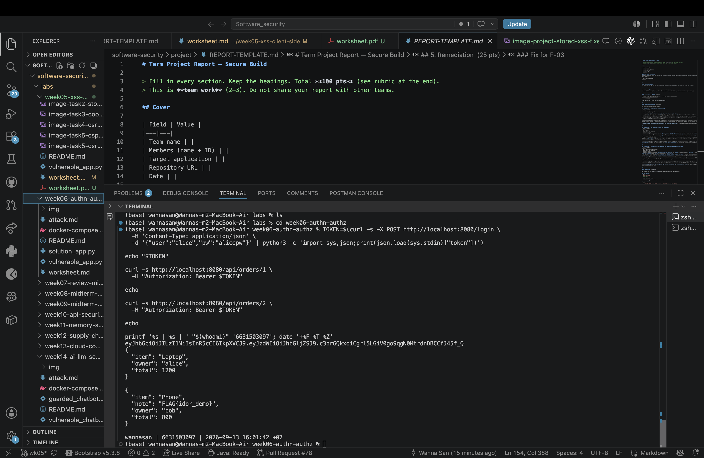
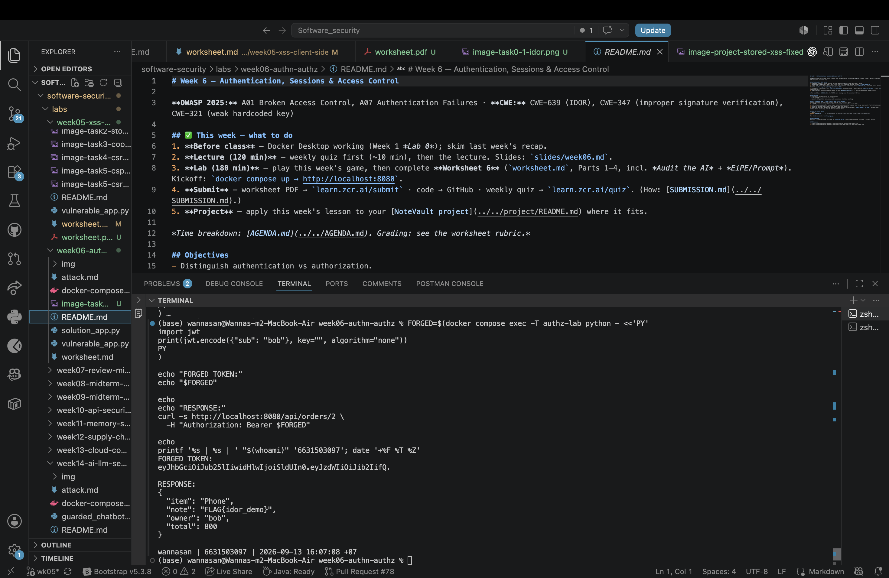
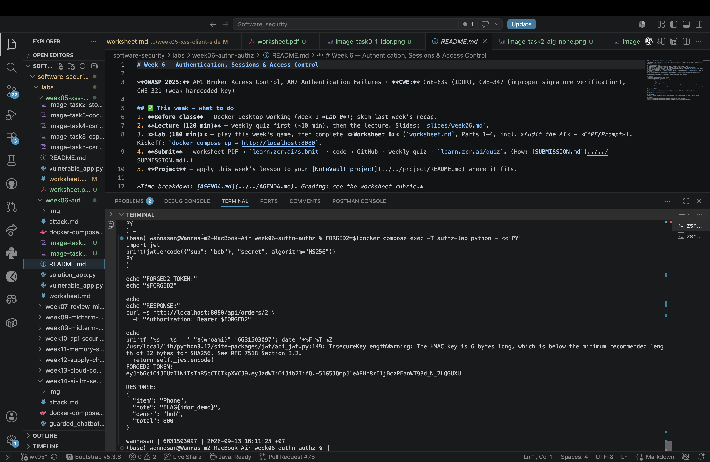
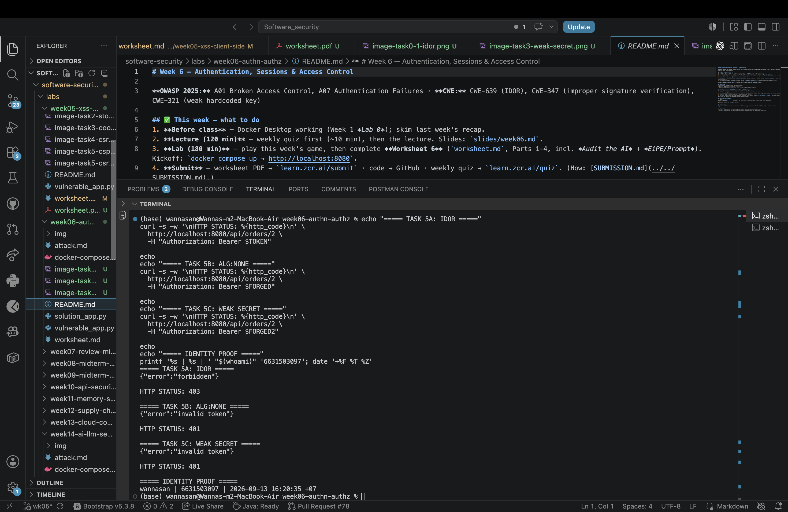

# Worksheet 6 — Authentication, Sessions & Access Control (3 hrs)

> **Course:** Software Security (KOSEN69) · **Week 6**
> **Aligned:** OWASP 2025 **A01 Broken Access Control**, **A07 Authentication Failures** · **CWE-639** (IDOR), **CWE-347** (improper signature verification), **CWE-321** (weak hardcoded key)
> **Signature games:** 🗺️ **IDOR Treasure Hunt** — walk the `oid` numbers to loot orders that aren't yours · 🔏 **JWT Forgery** — mint a token you were never given.

> ⚠️ **Ethics note:** Forging tokens and accessing other users' objects is only legal in this sandbox (`vulnerable_app.py`) and your own Juice Shop. Doing it to a real service is unauthorized access. Keep all activity inside `http://localhost:8080`.

## Part 1 — Student Information

| Name | Student ID | Date | Group |
|------|-----------|------|-------|
| Wanna-San | 6631503097 | 2026-09-13 | The Outsider |

**AI-use disclosure:** I used ChatGPT/Codex for guidance, troubleshooting, drafting, requirement checking, and code assistance. I personally ran the commands, verified the results, and captured the screenshots.


## Part 2 — Lecture Questions

Answer in 2–4 sentences each.

1. Distinguish **authentication** from **authorization**. In `vulnerable_app.py`, `get_order` calls `current_user()` but ignores its result (L63) — which of the two is missing?

   Authentication proves who a user is, while authorization decides what that user may access. The vulnerable `get_order()` authenticates the request but does not use the returned username to check ownership, so authorization is missing.

2. What is **IDOR** (CWE-639)? Why is `/api/orders/<oid>` exploitable, and what single check in `solution_app.py` (L64) closes it?

   IDOR occurs when an application accepts a direct object identifier without checking whether the current user owns or may access that object. Changing `oid` exposes another user's order; `if order["owner"] != user:` closes the flaw by returning 403 for a non-owner.

3. Explain the **`alg:none`** JWT attack. Why does listing `"none"` in `algorithms=[...]` (L55) let an attacker submit an *unsigned* token?

   A JWT using `alg:none` has no signature. The vulnerable code trusts the token's untrusted algorithm header and disables signature verification for `none`, so an attacker can create a token claiming to be Bob without knowing a key.

4. Why is the hardcoded HMAC secret `"secret"` (CWE-321) dangerous even if `alg:none` were disabled? How does a strong random secret + pinned algorithm defend the token?

   Because `secret` is short, predictable, and present in source code, an attacker can use it to sign a valid HS256 token. A strong random managed secret makes guessing impractical, while pinning HS256 prevents the client from selecting an unsafe verification method.

5. What do the JWT claims **`exp`** and **`aud`** add, and why does the secure version reject tokens that lack them?

   `exp` limits how long a stolen token remains useful, and `aud` restricts the service for which the token is intended. The secure version requires both so that an unscoped or non-expiring token cannot be accepted.

## Part 3 — Hands-on Lab (150 min)

**Learning goals:** exploit IDOR, forge JWTs two ways (`alg:none` and weak secret), then prove `solution_app.py` enforces ownership and rejects forged tokens. Steps mirror `attack.md`.

**Prerequisites:** Docker + Docker Compose, `curl`, `python3` with `pyjwt`, optionally Burp Suite. Working dir: `labs/week06-authn-authz/`.

### Environment setup

```bash
cd labs/week06-authn-authz
docker compose up            # python:3.12-slim + flask + pyjwt, runs vulnerable_app.py
# vulnerable app -> http://localhost:8080   (service name: authz-lab, port 8080)
```
Optional secondary target / proxy:
```bash
docker run --rm -p 3000:3000 bkimminich/juice-shop       # -> http://localhost:3000
# Burp Suite: put the proxy listener AND the browser proxy on 127.0.0.1:8081.
# NOT 8080 — the lab app already owns host 8080 (docker-compose.yml, "8080:5000").
# Burp's own default listener is 8080, so you must change it: leave it there and
# either the listener refuses to start ("Address already in use") or, if it does
# bind, the browser's proxy address is the target's address and every request
# goes straight to the app instead of through Burp — you intercept nothing.
```

**What to submit per task:** the exact **command/token**, a **screenshot** of the JSON response, and a **2–3 sentence mitigation**.

---

**Task 0 — Onboarding (5 min).** Get alice's token (from `attack.md`):
```bash
TOKEN=$(curl -s -X POST http://localhost:8080/login \
  -H 'Content-Type: application/json' \
  -d '{"user":"alice","pw":"alicepw"}' | python3 -c 'import sys,json;print(json.load(sys.stdin)["token"])')
echo "$TOKEN"
```
Confirm `/api/orders/1` returns alice's Laptop order. *Deliverable: screenshot of the token + order 1.*

I ran the login command and obtained Alice's valid JWT, then requested order 1 with that token. The response identified Alice as the owner and returned the Laptop with a total of 1200; the token itself is retained only in the screenshot and is not copied into this worksheet.



**Task 1 — IDOR Treasure Hunt (30 min) 🗺️.**
- *Goal:* read **bob's** order with **alice's** token.
- *Steps:*
  ```bash
  curl -s http://localhost:8080/api/orders/1 -H "Authorization: Bearer $TOKEN"   # yours
  curl -s http://localhost:8080/api/orders/2 -H "Authorization: Bearer $TOKEN"   # bob's — leaks!
  ```
- *Deliverable:* both responses + screenshot of bob's `Phone` order + why the missing ownership check (CWE-639) is the root cause.

Using the same valid Alice token, I changed the object ID to 2 and received Bob's Phone order with a total of 800. The shared Task 0/1 screenshot above records both responses; authentication succeeded, but the endpoint never compared the order owner with Alice, causing CWE-639 IDOR. The mitigation is a server-side ownership check on every object request, returning 403 when the owner does not match the authenticated user.

```sim
jwt-forge
```

**Task 2 — JWT Forgery via alg:none (30 min) 🔏.**
- *Goal:* impersonate bob with an **unsigned** token (no secret needed).
- *Steps:*
  ```bash
  FORGED=$(python3 - <<'PY'
  import jwt
  print(jwt.encode({"sub": "bob"}, key="", algorithm="none"))
  PY
  )
  curl -s http://localhost:8080/api/orders/2 -H "Authorization: Bearer $FORGED"
  ```
- *Deliverable:* the forged token + screenshot of the accepted response + explanation of the `none` flaw (CWE-347).

I generated the unsigned token shown by the supplied command with the claim `{"sub":"bob"}`. The vulnerable application accepted it and returned Bob's Phone order because its decoder allowed `none` and disabled signature verification, which is CWE-347. The mitigation is to pin an approved signed algorithm and always verify the signature and required claims.



**Task 3 — JWT Forgery via weak secret (30 min) 🔏.**
- *Goal:* sign a *valid* HS256 token because the secret is the guessable string `secret` (CWE-321).
- *Steps:*
  ```bash
  FORGED2=$(python3 - <<'PY'
  import jwt
  print(jwt.encode({"sub": "bob"}, "secret", algorithm="HS256"))
  PY
  )
  curl -s http://localhost:8080/api/orders/2 -H "Authorization: Bearer $FORGED2"
  ```
- *Deliverable:* token + screenshot + 2–3 sentences on why secret strength + key management matter.

I signed an HS256 token claiming `{"sub":"bob"}` with the hardcoded value `secret`, and the vulnerable application accepted it and returned Bob's Phone order. PyJWT also warned that the six-byte key was insecurely short; a strong random secret kept outside source control prevents attackers from signing their own tokens.



**Task 4 — Privilege/identity escalation reasoning (25 min).**
- *Goal:* combine the flaws. Using Task 2/3 you became `bob` *without his password*; using Task 1 you read objects you don't own.
- *Steps:* document the full attack chain (forge token → access any `oid`). Optionally replay the requests through **Burp Suite Repeater** and screenshot the intercepted request/response.
- *Deliverable:* a short chain diagram/paragraph + Burp (or curl) evidence.

An attacker can forge a JWT claiming to be Bob using either `alg:none` or the weak hardcoded secret `secret`. The server accepts the forged identity, while the missing ownership check also lets any authenticated user change `oid` and read another user's order; therefore broken authentication and broken authorization combine into impersonation and unauthorized data access. The genuine curl evidence is recorded in Tasks 1–3; Burp was not used.

**Task 5 — Defend / fix it (30 min) 🛡️.**
- *Goal:* prove `solution_app.py` blocks Tasks 1–3.
- *Steps:* stop the vulnerable container (`Ctrl-C`), then:
  ```bash
  docker compose run --rm --service-ports authz-lab bash -c "pip install --no-cache-dir flask pyjwt && python solution_app.py"
  ```
  Re-run: get a fresh alice token, then re-fire each attack. Expected: `/api/orders/2` with alice's token → **403 forbidden** (ownership check, L64); the `alg:none` token → **401 invalid token** (algorithm pinned to HS256, L50); the `"secret"` token → **401** (strong random secret + required `aud`/`exp`, L10/40).
- *Deliverable:* screenshots of the 403 and both 401s + name the fix line for each.

I ran `solution_app.py` and repeated the three attacks. A fresh Alice token requesting Bob's order returned `{"error":"forbidden"}` with HTTP 403, while both the unsigned token and the token signed with `secret` returned `{"error":"invalid token"}` with HTTP 401.

The ownership check is at `solution_app.py:63-65`. HS256 is pinned and signature, audience, and expiry validation occur at lines 46-51; the login adds `aud` and `exp` at lines 36-42, and the secret is loaded from the environment or generated randomly at line 10. These separate checks enforce authorization after authentication.



## Part 4 — Reflection

1. **CWE/OWASP mapping:** map IDOR → **CWE-639 / A01**, the JWT forgeries → **CWE-347 & CWE-321 / A07**.

   The missing ownership check is IDOR, mapped to CWE-639 and OWASP A01 Broken Access Control. Accepting an unsigned JWT is CWE-347, and using the weak hardcoded signing key is CWE-321; both JWT problems map to A07 Authentication Failures.

2. **Real breach:** the **2022 Optus breach** exposed millions of customer records via an exposed/poorly-authorized API endpoint where identifiers could be enumerated — a textbook broken-access-control / IDOR-style failure. In 3–4 sentences connect it to Tasks 1 and 4 of this lab. *(Alternative: the Peloton API IDOR disclosure.)*

   The course material describes the 2022 Optus breach as an exposed or poorly authorized API where identifiers could be enumerated, exposing millions of customer records. This matches Task 1 because changing only an object identifier returned another user's data without a server-side ownership check. Task 4 shows how this access-control failure becomes even more serious when combined with identity forgery.

3. **Best mitigation:** between deny-by-default ownership checks, pinning the JWT algorithm, and a strong managed secret, which control protects the most attack surface here, and why is server-side authorization non-negotiable?

   Deny-by-default server-side ownership checks protect the broadest object-access surface because every request must prove permission for the specific object. Pinned JWT verification and a strong managed secret are also essential, but even a genuine valid token must not grant access to every user's data.

## Grading rubric (100)

| Criterion | Points |
|-----------|-------:|
| Part 2 — Lecture questions (conceptual accuracy) | 20 |
| Part 3 — Exploitation + evidence (payloads/tokens + screenshots, Tasks 1–4) | 40 |
| Part 3 — Defense (Task 5: fixes proven, lines cited) | 25 |
| Part 4 — Reflection (CWE/OWASP mapping, breach, mitigation) | 15 |
| **Total** | **100** |

---

## Evidence & Integrity (required)

- **Identity proof:** every screenshot/diagram must show a terminal running `printf '%s | %s | ' "$(whoami)" '<YOUR-STUDENT-ID>'; date '+%F %T %Z'` **in the
  same image as the evidence**. When the evidence is a browser page, a DevTools panel or a
  rendered response, put that terminal **beside the browser and capture the whole screen** — a
  cropped window carries nothing that identifies you, and the lab's own output is
  byte-identical for the whole cohort *by design*, so the stamp is the only thing that makes
  the shot yours. Generic or borrowed evidence is not accepted.
- **Personalized flag (if this lab issues one):** No personalized flag was issued or submitted in my Week 6 run. The lab was completed locally and no arena challenge was used.
  *Flags are unique per student — submitting another student's flag is a violation. How to submit: **learn.zcr.ai/submit** (full guide: `SUBMISSION.md` in the repo root).*
- **Explain in your own words** *(graded on your reasoning, not copied text):*
  1. What did you do, and **why did the vulnerability work**?
     I logged in as Alice, changed the order ID to Bob's order, and also tested two forged JWTs. The attacks worked because the vulnerable app accepted unsafe tokens and authenticated requests without checking whether the user owned the requested object.
  2. **Why does your fix actually stop it** — and what could still break it?
     The fixed app verifies signed, scoped, expiring tokens and separately rejects orders not owned by the authenticated user. Authorization could still fail if another endpoint forgets the same deny-by-default ownership check, so it must be enforced consistently and tested on every object endpoint.

---

## 🤖 Audit the AI (required)

AI is a power tool you must **distrust** — you are graded on your *critique*, not the AI's answer.

1. Ask an AI assistant to exploit **or** fix this week's vulnerability. Paste its full answer.
2. **Find what's wrong or risky** in it — insecure code, a subtly incomplete fix, a hallucinated API/function/CVE, a missed edge case, or wrong reasoning. Quote the exact line(s).
3. Produce the **correct, verified** version yourself and explain in 2–3 sentences why the AI's output was insufficient.

> Disclose your AI use in the Part 1 table. This task counts toward your **Defense + Reflection** score.

**AI answer used (full answer):**

> Fix IDOR by hiding object IDs and using hard-to-guess UUIDs. If attackers cannot predict the next object ID, they will not be able to access another user's record.

**What was wrong or risky:** The statement “If attackers cannot predict the next object ID” treats secrecy of an identifier as access control. UUIDs may still leak through links, logs, or API responses, and possessing an identifier must never prove authorization.

**Correct verified version:** The server authenticates the user and checks `order["owner"] != user` for every order request, returning HTTP 403 when the object belongs to someone else. This ownership check was verified with Alice's valid token against Bob's order 2; the fixed app denied it with 403.

---

## 🧠 Comprehension & Prompt (required)

**A. Explain in Plain English (EiPE).** In 2–3 sentences, in your own words, describe what this week's vulnerable code/endpoint actually *does* and *why it is exploitable* — explain the mechanism, don't dump jargon.

**B. Prompt Problem.** Write a **single prompt** that makes an AI produce a *correct, secure* fix for one finding. Run it: does the exploit now fail? If not, refine the prompt and try again. Submit the **final prompt + the verified result**.
*Graded on the prompt's precision and your verification — this trains problem decomposition and AI literacy (Denny et al. 2024).*

**A. EiPE:** Logging in proves the caller's identity, but the vulnerable endpoint trusts the number in the URL and does not check who owns that order. It also accepts unsafe JWTs, so a valid-looking identity alone does not mean the caller may access every object.

**B. Final prompt:** “Modify only the Flask `get_order(oid)` authorization logic while preserving its existing response behavior: authenticate the bearer token, deny access by default, and return JSON `forbidden` with HTTP 403 whenever `order["owner"]` does not equal the authenticated user. Keep 401 for invalid tokens and 404 for missing orders, then verify the fix by using a fresh valid Alice token to request Bob's order 2 and report the exact status and body without inventing results.”

**Verified result:** With the fixed app, a fresh Alice token requesting Bob's order 2 returned `{"error":"forbidden"}` and HTTP 403.

**FINAL WEEK 6 COMMIT LINK:** (https://github.com/6631503097/software-security/commit/9889762)
